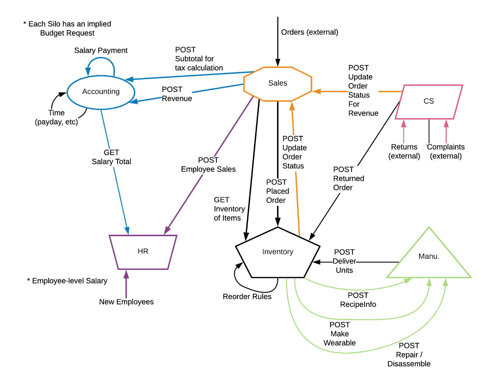

# TERM-PROJECT: KennUWare

An ERP system developed using Rust and React, with a PostgreSQL database.

## Team Inventory


- **Nick Mosher** (Team Coordinator/VC Coordinator)
- **Leon Kuhne** (Integration Coordinator)
- **Bryce Murphy** (Requirements Coordinator/Configuration Coordinator)
- **Fikayo Olutunji** (Quality Assurance Coordinator) 

---

## Prerequisites

A typical development flow requires installing the following tools:

* [Rust](https://rustup.rs)
* [Docker](https://docs.docker.com/v17.09/engine/installation/#desktop)
* [Docker Compose](https://docs.docker.com/compose/install/)

---

## How to setup the backend

Start by launching the development docker-compose image. This will start a
postgres database on port 5432 which the backend service can use.

```
docker-compose -f deployments/development/docker-compose.yml up
```

After postgres is running, navigate to the `backend/` directory and use
the `diesel_cli` tool to initialize the database and run the migrations.

```
cd backend/
cargo install diesel_cli --no-default-features --features postgres
diesel setup
diesel migration run
```

At this point you can connect to postgres using a db client (such as IntelliJ
Ultimate), the development credentials for the database are as follows:

```
POSTGRES_DB=inventory
POSTGRES_USER=postgres
POSTGRES_PASSWORD=inventory-development
```

After running the diesel migrations, you should see the application's tables
in postgres. In order to tell the backend service how to connect to the
database, we use the `DATABASE_URL` environment variable, which can be set by
placing a definition in the `.env` file. An example `.env.dev` file is
provided with the development username, password, and database name filled out.
You can get started right away by simply copying `.env.dev` to `.env`.

```
# In backend/
cp .env.dev .env
```

Finally, launch the backend service using cargo:

```
cargo run
```

---

## How to setup the frontend
Firstly, make sure yarn is installed.

To start the server, run the following commands in the `frontend` directory
```
yarn
yarn build
yarn start
```

This should open up the url in a browser, if not navigate to `localhost:3000`

---

## Connecting to Production and Deploying

### Set up SSH

To connect to our production machine on EC2, be sure to first log in to the AWS
console and generate a new keypair for yourself. This can be done in the EC2
dashboard. You'll be prompted to download a `.pem` file, which you should put
in your `~/.ssh/` folder, e.g. as `~/.ssh/my_key.pem`. This is your private key,
make sure you don't share it with anybody. If you're on Linux, you'll also have
to change the permissions of this file to be read-only to your user.

```
chmod 400 ~/.ssh/my_key.pem
```

The next thing we need to do is generate your public key from the private key you
downloaded. I thought that AWS was supposed to automatically add your public key
to the EC2 instance but it seems to not be doing that. To find your public key,
run this command:

```
ssh-keygen -y -f ~/.ssh/my_key.pem > ~/.ssh/my_key.pub
```

Once you have your `my_key.pub`, send it to one of the members of the team who
already has access to the EC2 instance and all they have to do is append your key
to the end of the `~/.ssh/authorized_keys` file _on the EC2 instance_.

Next, you should set up your SSH config file `~/.ssh/config` with the hostname
and login information of the EC2 instance so you can ssh to the EC2 instance
easier. If that file doesn't exist, create it and add this configuration to it.
If it does already exist, just append this configuration to the end.

```
Host swen343
	Hostname ec2-3-16-181-169.us-east-2.compute.amazonaws.com
	IdentityFile ~/.ssh/my_key.pem
	User ec2-user
```

After you save this config file, you should be able to SSH into our production
EC2 instance using just `ssh swen343`.

### Pushing code to Production

On your local machine, build and push the project docker image using the
following commands:

```
docker build -t nicholastmosher/swen343-inventory:latest .
docker push nicholastmosher/swen343-inventory:latest
```

Then ssh into the production machine and run the following:

```
cd ~/inventory
docker-compose pull inventory && docker-compose up -d
```

This will launch the project as a daemon, which will not allow you to see logs
but will let you detach the terminal and keep running. If you would instead
like to see the logs, run this (without the `-d`):

```
docker-compose pull inventory && docker-compose up
```

Note that when you exit from the non-daemon command, the project will quit and
you'll need to re-run it with `-d`.

### Running the Postman Integration Tests

Testing for this project is done via the postman api. To run these tests,
make sure to first install newman, the command line collection-runner for
Postman. To install newman globally, run the following command:

```
npm install -g newman
```

If you wish to install it locally, simply remove the '-g' tag.
If you do not have the npm package manager, you can install that
here: https://www.npmjs.com/get-npm.

Once newman is installed, launch the docker-compose image if it is
not already running:

```
docker-compose -f deployments/development/docker-compose.yml up
```

The newman tests assume that the database is empty and will make
its judgments based on that. In order to ensure that the database
is in a proper state for this, in a new terminal, run:

```
diesel database reset
```

Now, launch the backend service with the following command
(remember that you have to be in the 'backend' folder for this)

```
cargo run
```

With another new terminal, navigate to the postman tests directory
(from the root directory, this is 'backend/postman') and run the
tests with this:

```
newman run Inventory-Full-V1.postman_collection.json -e Development.postman_environment.json
```

---

## Stubbing

For testing purposes, environment variables can be set in the `.env` file, such that other silos' endpoints can be tested against, given the correct url. The variables are case sensitive and once they're added, the code will automatically try these endpoints. If any of these silo URLs are not given, then Inventory will pretend to receive dummy responses without actually calling out to the service.

```
MANUFACTURING_URL=
ACCOUNTING_URL=
SALES_URL=
```

---

## Architecture

The inventory component of the ERP system is a web application which hosts a REST service as a backend and a React client-side application as a frontend. The inventory frontend provides a graphical user interface for interacting with the inventory system for use cases which are isolated to the inventory domain. However, the backend exposes more endpoints which are available for other components of the ERP system to use, which is how we enable integration with those other components. Separating our architecture allowed for more of our team to work on the code at the same time, and for a more directed architecture.  


### Frontend

Our frontend is a statically-served is a nodejs application, using ReactDOM, WebPack, and pug, which dynamically fetch content to render. These calls target our backend service, which hosts a server to respond to the requests of the client application. We chose this stack along with npm, a powerful package manager, because of their simple, fast, and well documented capabilities. (HTML) templates are used to allow for much of our frontend UI to be duplicated, making for less work during later modifications.

### Backend

Our backend is a Rust web service which uses the actix-web web framework for handling HTTP requests. This framework is supported by the actix Actor framework which enables high concurrency and load balancing even with local resources. Actix-web pairs nicely with the Serde (serialization/deserialization) Rust library, which allows for automatic deserialization of requests and serialization of responses. Finally, the application communicates with our Postgres database through the Diesel Object Relational Mapper (ORM) for Rust, which allows us to use native Rust functions to describe a query, and auto generates the corresponding SQL with the proper variable bindings.


### Database


---

## Order Fulfillment Family Flow


---

## API Endpoints

The ERP's general endpoint architecture can be described well here. As far as we are concerned, our flow starts with either Sales or Customer Support, which triggers a call to Manufacturing in most cases. The sole case in which we would not involve them is if we already have a certain product in stock that does not break any reorder rules set. In other cases, manufacturing either makes, repairs, or disassembles a product and gives it back to us, which we then handle again.



All our API Documentation is filled out in our Postman Documentation, located [here](http://dev-inventory.kennuware.xyz)!

---

## Design Patterns

* Actor Model - The Actix-web framework we’re using is built on top of the Actix actor system. This means that requests are handled by passing strongly typed messages to actors which understand how to handle those message types. This gives the runtime a great amount of flexibility to load-balance actors and message queues on thread pools and to make our request handlers asynchronous.
* Domain Model - Because the hope for this software is to have it grow to be an enterprise software solution, we plan to implement the Domain Model design pattern for managing our data and component interactions. Having the system be divided into objects that all contain their own data and behavior will make the system easier to work with as it grows larger and more complex
* Transform View - We are using the transform view pattern for the frontend mainly because that is the default flow of our chosen frontend technology, React. By default, React steps through the domain data it is working with and directly manipulates the DOM based on what is found and in any format desired.

---

## Challenges Faced

**Schedule**
* A definite painpoint for the Inventory boys was how this project lined up with other committments we made, either in other classes or elsewhere. This led to a lot of functionality and code being pushed off until a later date, affecting how quickly we were able to report to other teams about how we worked. By no means was it horrible, but it was not perfect either.

**Scope**
* Scope was another pain point for not only us, but for the majority of the silos working on this project. Referring to what was required of us in this project vs what we had to do in other classes and in the semester - and similar to the Schedule challenges - we had to put in a much greater amount of time into this project to achieve comparatively little progress. Other committments in other classes also hindered our ability to get a lot done at once. 

* At least for Inventory, we recieved a small reduction in scope by our stakeholder, who allowed us to drop the requirement of accounted for warehouse sections. This was a very welcomed change, since we would have likely faced a whole new string of issues once implementing these into our warehouses, not to mention the redundancy of it all. The change in immediate requirements bought us a little more time and a little less work.

**Cross-team Integration**
* This was something we foresaw, but were still hit with difficulties on. Simply put, if managing processes internally is difficult, external processes are even harder. How we will send out and recieve data, how exactly we'll parse through it, and then how we dealt with unexpected responses all caused quite a headache, especially when the team sending and recieving was also facing the same issues. After that, considering their own challenges with Scope and Schedule, and one can see how such integration was very maticulous. 

---

## License

MIT License

See LICENSE for details.
